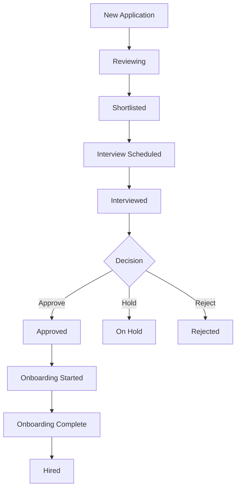

# Intern Onboarding System - Complete Implementation Guide

## Overview

This document provides a complete guide to the Intern HRMS Onboarding System, covering the entire recruitment-to-hire workflow with interview stages, document verification, and automated employee account creation.

---

## System Architecture

### Complete Recruitment Flow

```
1. Application Received → Status: new
2. HR Reviews → Status: reviewing
3. Shortlist → Status: shortlisted → Send Interview Invite Email
4. Interview Scheduled → Status: interview_scheduled
5. Post-Interview Decision:
   - Approve → Status: approved → Send Approval Email
   - Hold → Status: on_hold
   - Reject → Status: rejected
6. Start Onboarding → Only available for approved candidates
7. Candidate Completes Onboarding Wizard:
   - Confirm residential address
   - Upload documents (Photo, ID Proof, Certificates)
   - Review & accept offer letter (PDF)
   - Sign digital NDA
8. HR Reviews Documents → Approve & Create Employee
9. Hired → Status: hired, Auth user created, Employee ID generated
```

---

## Database Schema

### Tables Modified/Created

#### 1. `internship_applications`
**New Columns:**
- `interview_date` (TIMESTAMPTZ) - Scheduled interview date and time
- `interview_notes` (TEXT) - HR notes from the interview

**Updated Status Values:**
- `new` - Application received
- `reviewing` - Under HR review
- `shortlisted` - Selected for interview
- `interview_scheduled` - Interview invite sent
- `interviewed` - Interview completed
- `approved` - Post-interview approval
- `on_hold` - Candidate on hold
- `hired` - Successfully hired
- `rejected` - Application/interview rejected

#### 2. `hrms_onboarding`
**Columns:**
- `id` (UUID, PK)
- `application_id` (UUID, FK → internship_applications)
- `personal_email` (TEXT)
- `residential_address` (TEXT)
- `preferred_start_date` (DATE)
- `offer_status` (TEXT) - 'pending', 'accepted', 'rejected'
- `nda_status` (TEXT) - 'pending', 'signed'
- `nda_signed_at` (TIMESTAMPTZ)
- `photo_url` (TEXT) - Path to candidate photo in Storage
- `id_proof_url` (TEXT) - Path to ID document
- `certificates_url` (TEXT) - Path to certificates

#### 3. `hrms_employees`
**New Column:**
- `photo_url` (TEXT) - Employee photo (copied from onboarding)

---

## Supabase Storage

### Bucket: `onboarding_docs`
**Purpose:** Store candidate-uploaded documents during onboarding

**Policies:**
- Public read access
- Authenticated insert access
- Files stored with paths like: `{onboarding_id}/photo.jpg`

**File Types:**
- Photos (JPEG, PNG)
- ID Proofs (PDF, JPEG, PNG)
- Certificates (PDF)

---

## Backend Functions

### RPC Function: `create_user_for_employee`

**Purpose:** Creates a Supabase Auth user and employee record atomically without logging out the admin.

**Parameters:**
```typescript
{
  new_email: string,           // System login ID (emp-xxxx@go-aitech.com)
  new_password: string,         // Generated password
  new_employee_code: string,    // Employee code (EMP-XXXX)
  new_first_name: string,
  new_last_name: string,
  new_designation: string,
  new_photo_url?: string        // Optional photo path
}
```

**Returns:**
```typescript
{
  success: boolean,
  user_id?: string,
  email?: string,
  error?: string
}
```

**Security:**
- `SECURITY DEFINER` - Runs with elevated privileges
- Only accessible by HR Admins (checked via RLS)
- Creates user in `auth.users` with encrypted password
- Auto-confirms email
- Links to `hrms_employees` record

---

## Frontend Components

### 1. Recruitment Module (`Recruitment.tsx`)

**Features:**
- Application listing with search and filters
- Status-based workflow actions
- Interview stage management
- Document review
- Employee creation

**Interview Stage Actions:**

**For Shortlisted Candidates:**
```tsx
<Button onClick={handleSendInterviewInvite}>
  📧 Send Interview Invite
</Button>
```

**For Interview Scheduled:**
```tsx
<Button onClick={handleMarkInterviewed}>
  ✓ Mark as Interviewed
</Button>
```

**Post-Interview Decision:**
```tsx
<Button onClick={() => handlePostInterviewDecision('approved')}>
  ✓ Approve Candidate
</Button>
<Button onClick={() => handlePostInterviewDecision('on_hold')}>
  ⏸ Hold
</Button>
<Button onClick={() => handlePostInterviewDecision('rejected')}>
  ✗ Reject
</Button>
```

**Onboarding Actions:**
```tsx
// Only enabled for approved candidates
<Button 
  disabled={status !== 'approved'}
  onClick={handleStartOnboarding}
>
  Start Onboarding
</Button>
```

**Final Approval:**
```tsx
// Only shown after NDA is signed
<Button onClick={handleCreateEmployee}>
  Approve & Send Credentials
</Button>
```

### 2. Onboarding Wizard (`OnboardingWizard.tsx`)

**Public Route:** `/onboarding/:id`

**Steps:**

**Step 1: Confirm Details**
- Residential address input
- Preferred start date selection

**Step 2: Upload Documents**
- Photo upload (required)
- ID Proof upload (required)
- Certificates upload (optional)
- Files uploaded to `onboarding_docs` bucket

**Step 3: Offer Letter**
- PDF generated using `jspdf`
- Contains position, start date, compensation details
- Accept/Reject buttons

**Step 4: Digital NDA**
- NDA text display
- Digital signature input
- Timestamp recorded on signing

**Step 5: Completion**
- Success message
- Next steps information

### 3. Employee List (`EmployeeList.tsx`)

**Features:**
- Employee photo display (circular avatars)
- Search and filter
- CRUD operations
- Role management

**Photo Display:**
```tsx
{emp.photo_url && (
  
)}
```

---

## Email Notifications

### Interview Invitation
**Trigger:** HR clicks "Send Interview Invite"
**Recipient:** Candidate's personal email
**Content:**
- Interview date/time
- Location/meeting link
- What to prepare

### Approval Notification
**Trigger:** HR approves candidate post-interview
**Recipient:** Candidate's personal email
**Content:**
- Congratulations message
- Next steps (onboarding link will follow)

### Onboarding Link
**Trigger:** HR clicks "Start Onboarding"
**Recipient:** Candidate's personal email
**Content:**
- Unique onboarding link
- Deadline to complete
- Required documents list

### Welcome Credentials
**Trigger:** HR clicks "Approve & Send Credentials"
**Recipient:** Candidate's personal email
**Content:**
- Login ID: `emp-xxxx@go-aitech.com`
- Temporary password
- Portal link
- First login instructions

---

## SQL Migrations

### Migration Order

1. **`hrms_onboarding.sql`**
   - Creates onboarding table
   - Sets up RLS policies

2. **`update_onboarding_docs.sql`**
   - Adds document columns
   - Creates storage bucket

3. **`add_interview_stage.sql`**
   - Adds interview columns
   - Updates status constraints

4. **`add_employee_photo.sql`**
   - Adds photo_url to employees

5. **`create_user_rpc.sql`**
   - Creates RPC function for user creation

---

## Security Considerations

### Row Level Security (RLS)

**`hrms_onboarding` table:**
```sql
-- HR Admins: Full access
CREATE POLICY "hr_admin_all" ON hrms_onboarding
  FOR ALL USING (
    EXISTS (
      SELECT 1 FROM hrms_employees 
      WHERE auth_id = auth.uid() 
      AND hrms_role IN ('super_admin', 'hr_admin')
    )
  );

-- Candidates: Read own record via ID
CREATE POLICY "candidate_read_own" ON hrms_onboarding
  FOR SELECT USING (true);
```

### Storage Policies

**`onboarding_docs` bucket:**
- Public read (for HR to view documents)
- Authenticated insert (candidates can upload)
- No public delete/update

### Password Security

- Passwords encrypted using bcrypt (`crypt` function)
- Temporary passwords follow pattern: `Welcome{4digits}!`
- Users should be prompted to change on first login

---

## Testing Checklist

### End-to-End Flow

- [ ] Submit internship application
- [ ] HR reviews and shortlists
- [ ] Interview invite sent (check email simulation)
- [ ] Mark as interviewed
- [ ] Approve candidate (check approval email)
- [ ] Start onboarding (link copied)
- [ ] Complete onboarding wizard:
  - [ ] Address confirmation
  - [ ] Document uploads (all 3 types)
  - [ ] Offer letter acceptance
  - [ ] NDA signing
- [ ] HR reviews documents
- [ ] HR approves & creates employee
- [ ] Verify employee record created
- [ ] Verify Auth user created
- [ ] Verify photo transferred to employee profile
- [ ] Test login with generated credentials

### Edge Cases

- [ ] Reject candidate at interview stage
- [ ] Put candidate on hold
- [ ] Candidate rejects offer letter
- [ ] Missing documents during upload
- [ ] Duplicate employee code handling
- [ ] RPC function error handling

---

## Deployment Steps

### 1. Database Setup

```bash
# Run migrations in Supabase SQL Editor
1. hrms_onboarding.sql
2. update_onboarding_docs.sql
3. add_interview_stage.sql
4. add_employee_photo.sql
5. create_user_rpc.sql
```

### 2. Storage Configuration

- Verify `onboarding_docs` bucket exists
- Check bucket policies (public read, auth insert)
- Test file upload/download

### 3. Environment Variables

```env
VITE_SUPABASE_URL=your_supabase_url
VITE_SUPABASE_ANON_KEY=your_anon_key
```

### 4. Frontend Deployment

```bash
npm install
npm run build
# Deploy to your hosting platform
```

### 5. Email Integration (Future)

- Set up Resend/SendGrid API
- Create email templates
- Implement edge functions for email sending
- Replace toast notifications with actual emails

---

## Future Enhancements

### Phase 3: Automation & Controls
- Auto-blocking rules for inactive employees
- Password reset functionality
- Email integration (Resend)

### Phase 4: Advanced Features
- Interview scheduling calendar
- Automated reminder emails
- Document expiry tracking
- Bulk operations for HR

### Phase 5: Analytics
- Recruitment funnel metrics
- Time-to-hire tracking
- Interview success rates
- Onboarding completion rates

---

## Troubleshooting

### Common Issues

**Issue:** RPC function fails with "Access Denied"
**Solution:** Ensure logged-in user has `hr_admin` or `super_admin` role

**Issue:** Documents not uploading
**Solution:** Check storage bucket policies and CORS settings

**Issue:** Employee creation succeeds but no Auth user
**Solution:** Verify RPC function was deployed correctly, check Supabase logs

**Issue:** Photos not displaying
**Solution:** Verify `VITE_SUPABASE_URL` is set correctly, check storage bucket is public

**Issue:** Onboarding link not working
**Solution:** Ensure route `/onboarding/:id` is configured in `App.tsx`

---

## Support & Maintenance

### Monitoring

- Check Supabase logs for RPC errors
- Monitor storage usage
- Track failed email deliveries (once integrated)

### Backup Strategy

- Regular database backups via Supabase
- Storage bucket backups
- Version control for all code changes

---

## Credits

**Developed by:** GoAI Zenith Team
**Version:** 2.0
**Last Updated:** January 2026

---

## Appendix

### Employee ID Format
- Pattern: `EMP-{4-digit-random}`
- Example: `EMP-1234`
- Login: `emp-1234@go-aitech.com`

### Status Workflow Diagram



### File Structure

```
goai-zenith/
├── src/
│   ├── hrms/
│   │   ├── pages/
│   │   │   ├── Recruitment.tsx
│   │   │   ├── OnboardingWizard.tsx
│   │   │   └── EmployeeList.tsx
│   │   └── layout/
│   │       └── HRMSLayout.tsx
│   └── App.tsx
├── hrms_onboarding.sql
├── update_onboarding_docs.sql
├── add_interview_stage.sql
├── add_employee_photo.sql
├── create_user_rpc.sql
└── docs/
    └── ONBOARDING_SYSTEM.md (this file)
```
